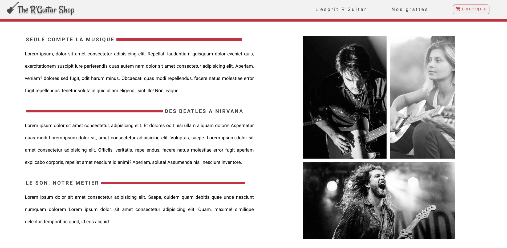

# R-Guitar-Shop
1er projet formation Le bocal Academy

***
## Objectifs

    Développer une page HTML/CSS en autonomie
    Développer une page sur la base d'un cahier des charges et d'un maquette
    
## Elaboration

* Respect complet du cahier des charges
* Utilisation du SCSS (nesting, variables, mixins)
* Site complétement Responsive et de maniere dynamique
* Améliration de l'ergonomie avec content (Margin) Before Target
